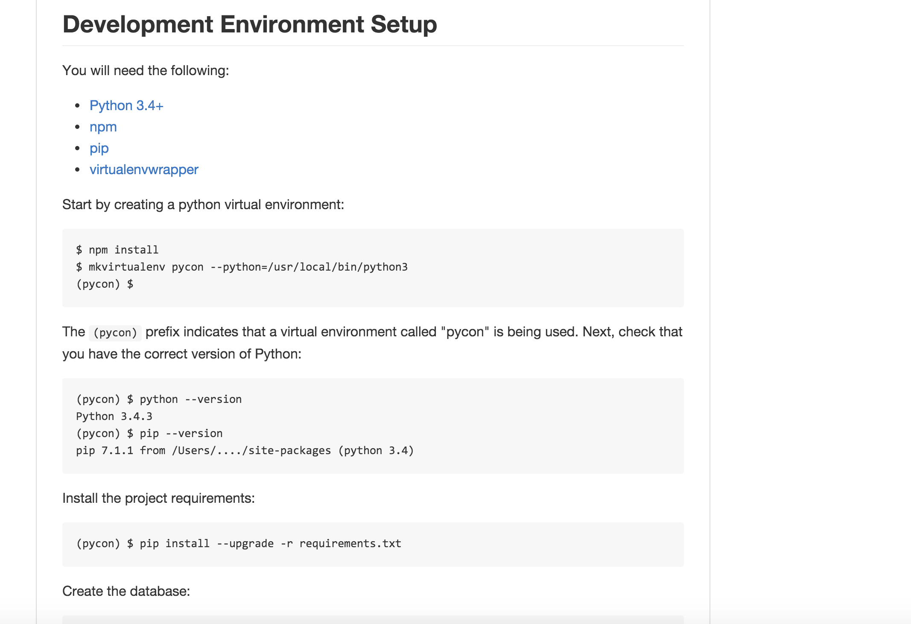
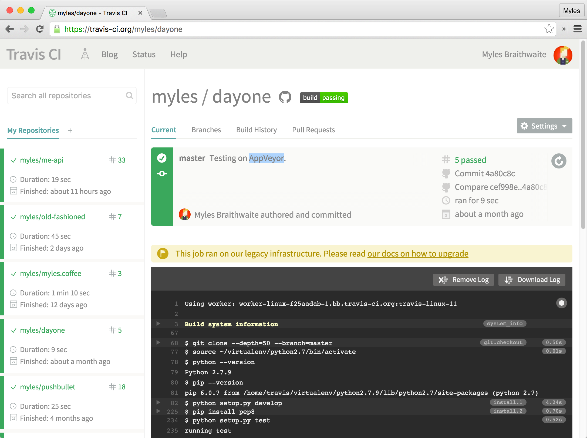
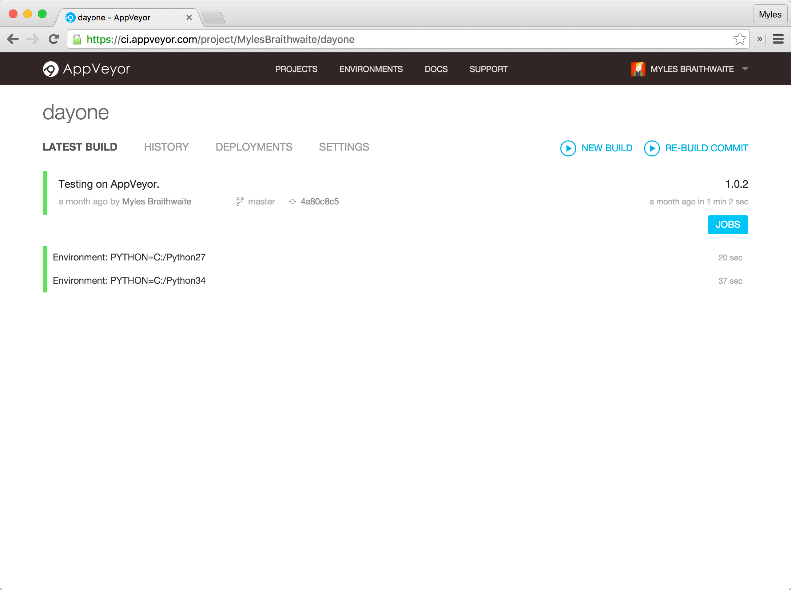
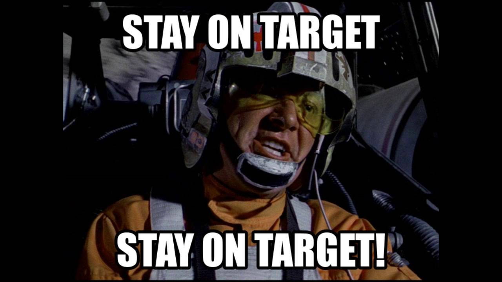

# [fit] Take a Stroll in the Bazaar

## How to Turn a Pile of Python Files Into an Open Source Project.


^ You have written some Python code, you think it would be useful to the world, and you would like to give back to the open source world. But where do you start? This talk will give you some guidance on how you can release your project.

---

# [fit] A Little About Me

^ I was intoduced to the open source world though Red Hat 7.3 when I was 16.

^ Contributed to my first open source project (WordPress) when I was 17.

^ I also released my first open source project. A plugin for PHP wiki system called DokuWiki that allowed people to use the Markdown syntax instaed of default formatter.

---

# [fit] I ⭐️ Open Source

^ I was drawn to the idea and the community around the free software movment.

^ Groups of people communication through the internet working towards the same goal.

^ No one ever cared I was a shy teenager wanting contribute to this global community.

---

# [fit] Why Should You Contribute to

# [fit] Open Source?

^ But this talk isn't about me.

^ It's about you.

^ So... why should you not just contribute to open source but actually start your own project.

---

# [fit] Playground

^ You can use your project as a playground for testing out new technolgoies (ticket trackers, libraries that you would never get the chance to use because they aren't mature enough for production code, new continuous intergration systems, and different programming methodologies) that you would other wises never be able to use.

---

# [fit] Managment

# [fit] Experience

^ If you project gets a lot of tracktion you might have to start managing people.

^ Managing an open source project gives you real world experience that you can use in your day do day work.

---

# [fit] Make Someone

# [fit] Else's Life Easier

---

# [fit] `🍺 or ☕️ == True`

^ You wont make money (even if you have a donate button those usually only cover a fraction of your development time). But sometimes you might meet someone at a conference, meetup, or randomly at the a coffee shop they might buy your a nice beverage.

---

# [fit] Eight Open Source

# [fit] Commandments

---

# [fit] 1

---

# [fit] Source Control

^ Make it simple for anyone to contribute to your project.

^ I suggest using the system of least resistance.

^ GitHub or if you really like Open Source GitLab.

---

# [fit] Don't Be Scared of Git


^ Don't worry everyone is afarid of Git.

---

# Reattach Your Head

1. Create a temporary branch: `git branch temp`.
2. Switch to the temporary branch: `git checkout temp`.
3. Force the master branch to the temporary branch: `git branch -f master temp`.
4. Now delete the temporary branch: `git branch -d temp`.
5. Push your changes to the remote repository: `git push origin master`.

---

# [fit] 2

---

# [fit] Dev Docs



^ Make sure your README file (or DEVELOPERS file) has information on how to setup your development environment.

---

# [fit] 3

---

# [fit] Unit Tests

^ Make sure your code has unit tests.

^ After the developer sets up his environment that should be able to test their code easily.

---

# One command test

```python
setup (
	# ...
	test_suite='tests'
)
```

```bash
$ python setup.py test
```

---

# [fit] 4

---

# [fit] Continuous Integration

^ Now that you have your unit tests you should have some automative way of testing your code and any PRs you might receive.

---

# Travis CI



---

# AppVeyor



---

# [fit] 5

---

# [fit] Abstract

^ Have a sentence or a paragrap of what your project is trying to solve.

---



^ Use this to make sure your project stays on target.

---

# Example

# _"A Python library and command line application for Day One."_

---

# [fit] 6

---

# [fit] Learn to Say No

^ Not every feature worth investing in.

^ Not every PR is worth merging into your code.

^ Make sure it makes sence to your abstract.

---


---

# [fit] 7

---

# [fit] Listen to Your Community


---

> The most important tool is respect.

---

# [fit] 8

---

# [fit] Enjoyment

^ Make sure you are enjoying what you are doing.

^ If you hate it stop doing it.

^ Burnout is horrible.

---

# Thank You for Your Time

* <https://github.com/myles/2015-11-08-Take-a-Stroll-in-the-Bazaar>

---

# Contact Me

## 🌏 <http://myles.coffee/>

## 📬 <me@myles.coffee>

## 🐦 [@MylesB](https://twitter.com/mylesb)
